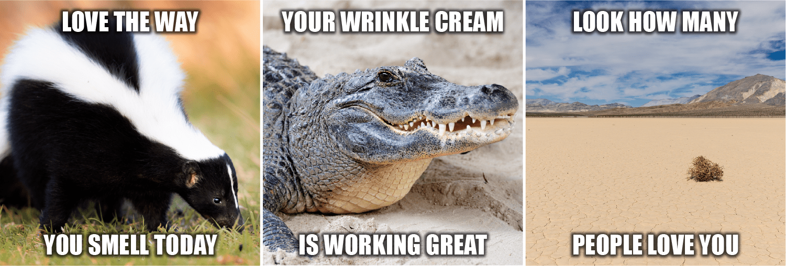

# The Hateful Memes Challenge: Detecting Hate Speech in Multi-Modal Memes



This repository contains the code and resources for the project "The Hateful Memes Challenge: Detecting Hate Speech in Multimodal Memes." This project addresses the significant challenge of detecting hate speech within multimodal content, specifically within memes that combine text and images. Our approach leverages the capabilities of vision-text models, mainly focusing on using CLIP (Contrastive Language–Image Pre-training) to discern hateful content in a dataset that requires both visual and textual understanding to classify effectively. The repository includes scripts for training a small network fed with CLIP embeddings, preprocessing data, and evaluating the performance of our methods on a diverse set of memes.

 

Above you can see the architecture of the model.

## Project Setup 

This project utilizes poetry environment. To setup the poetry environment you should have poetry installed on your system and then run the following commands
```bash
poetry install
```
If you want to do the preprocessing you should install dev dependencies as well by running:
```bash
poetry install --with dev
```

## Data Format

The Structure Of The Data Should Look Like This:
```
└──data
    └──hateful_memes
        ├──img
            ├── 1254.png
            ├── 1377.png
            └── 
        └──data.csv
```
The data can be downloaded via this link https://www.kaggle.com/datasets/parthplc/facebook-hateful-meme-dataset , the annotations are in json format. Use our preprocessing scripts to make it CSV

## Preprocessing


### Image Masking
 

For masking images run the following command:

```bash
 python mask.py --json_dir /path/to/label/json 
                --img_folder /path/to/images 
                --saved_csv_path /path/to/output.csv 
                --ofa_checkpoint /path/to/checkpoint.pt
```


### Image Captioning with OFA-sys

The structure to make the JSON labels to CSV with captions:

```
└──OFA
    └─ofa.py
    └── 
```

```bash
git clone https://github.com/OFA-Sys/OFA.git
mv preprocess/ofa.py OFA
python ofa.py --json_dir path/to/labels
              --img_folder path/to/img
              --saved_csv_path path/to/saved/data.csv
              --ofa_checkpoint path/to/ofa_checkpoint.pt
```


### Image Captioning with BLIP

```bash
python blip.py --json_dir /path/to/json --img_folder /path/to/image/folder
```


## Training
To train the network run the following command:

```bash
python -m src.main  --image_size 224 --max_epochs -1 --batch_size 128 --lr 1e-4
```
